## Samples

<table>
<thead>
<tr class="header">
<th style="text-align: left;">Sample name</th>
<th style="text-align: left;">Sample type</th>
<th style="text-align: left;">Mock status</th>
<th style="text-align: left;">Phylotype</th>
</tr>
</thead>
<tbody>
<tr class="odd">
<td style="text-align: left;">Rhodo1Mock10T16S</td>
<td style="text-align: left;">Rhodomonas</td>
<td style="text-align: left;">1e4 copies</td>
<td style="text-align: left;">16S</td>
</tr>
<tr class="even">
<td style="text-align: left;">Rhodo1Mock10T18S</td>
<td style="text-align: left;">Rhodomonas</td>
<td style="text-align: left;">1e4 copies</td>
<td style="text-align: left;">18S</td>
</tr>
<tr class="odd">
<td style="text-align: left;">Rhodo1Mock1T16S</td>
<td style="text-align: left;">Rhodomonas</td>
<td style="text-align: left;">1e5 copies</td>
<td style="text-align: left;">16S</td>
</tr>
<tr class="even">
<td style="text-align: left;">Rhodo1Mock1T18S</td>
<td style="text-align: left;">Rhodomonas</td>
<td style="text-align: left;">1e5 copies</td>
<td style="text-align: left;">18S</td>
</tr>
<tr class="odd">
<td style="text-align: left;">Rhodo1WWMock10T16S</td>
<td style="text-align: left;">WW + 1:1 Rhodomonas</td>
<td style="text-align: left;">1e4 copies</td>
<td style="text-align: left;">16S</td>
</tr>
<tr class="even">
<td style="text-align: left;">Rhodo1WWMock10T18S</td>
<td style="text-align: left;">WW + 1:1 Rhodomonas</td>
<td style="text-align: left;">1e4 copies</td>
<td style="text-align: left;">18S</td>
</tr>
<tr class="odd">
<td style="text-align: left;">Rhodo1WWMock1T16S</td>
<td style="text-align: left;">WW + 1:1 Rhodomonas</td>
<td style="text-align: left;">1e5 copies</td>
<td style="text-align: left;">16S</td>
</tr>
<tr class="even">
<td style="text-align: left;">Rhodo1WWMock1T18S</td>
<td style="text-align: left;">WW + 1:1 Rhodomonas</td>
<td style="text-align: left;">1e5 copies</td>
<td style="text-align: left;">18S</td>
</tr>
<tr class="odd">
<td style="text-align: left;">Rhodo10WWMock10T16S</td>
<td style="text-align: left;">WW + 1:10 Rhodomonas</td>
<td style="text-align: left;">1e4 copies</td>
<td style="text-align: left;">16S</td>
</tr>
<tr class="even">
<td style="text-align: left;">Rhodo10WWMock10T18S</td>
<td style="text-align: left;">WW + 1:10 Rhodomonas</td>
<td style="text-align: left;">1e4 copies</td>
<td style="text-align: left;">18S</td>
</tr>
<tr class="odd">
<td style="text-align: left;">Rhodo10WWMock1T16S</td>
<td style="text-align: left;">WW + 1:10 Rhodomonas</td>
<td style="text-align: left;">1e5 copies</td>
<td style="text-align: left;">16S</td>
</tr>
<tr class="even">
<td style="text-align: left;">Rhodo10WWMock1T18S</td>
<td style="text-align: left;">WW + 1:10 Rhodomonas</td>
<td style="text-align: left;">1e5 copies</td>
<td style="text-align: left;">18S</td>
</tr>
<tr class="odd">
<td style="text-align: left;">Rhodo100WWMock10T16S</td>
<td style="text-align: left;">WW + 1:100 Rhodomonas</td>
<td style="text-align: left;">1e4 copies</td>
<td style="text-align: left;">16S</td>
</tr>
<tr class="even">
<td style="text-align: left;">Rhodo100WWMock10T18S</td>
<td style="text-align: left;">WW + 1:100 Rhodomonas</td>
<td style="text-align: left;">1e4 copies</td>
<td style="text-align: left;">18S</td>
</tr>
<tr class="odd">
<td style="text-align: left;">Rhodo100WWMock1T16S</td>
<td style="text-align: left;">WW + 1:100 Rhodomonas</td>
<td style="text-align: left;">1e5 copies</td>
<td style="text-align: left;">16S</td>
</tr>
<tr class="even">
<td style="text-align: left;">Rhodo100WWMock1T18S</td>
<td style="text-align: left;">WW + 1:100 Rhodomonas</td>
<td style="text-align: left;">1e5 copies</td>
<td style="text-align: left;">18S</td>
</tr>
<tr class="odd">
<td style="text-align: left;">WWMock10T16S</td>
<td style="text-align: left;">WW</td>
<td style="text-align: left;">1e4 copies</td>
<td style="text-align: left;">16S</td>
</tr>
<tr class="even">
<td style="text-align: left;">WWMock10T18S</td>
<td style="text-align: left;">WW</td>
<td style="text-align: left;">1e4 copies</td>
<td style="text-align: left;">18S</td>
</tr>
<tr class="odd">
<td style="text-align: left;">WWMock1T16S</td>
<td style="text-align: left;">WW</td>
<td style="text-align: left;">1e5 copies</td>
<td style="text-align: left;">16S</td>
</tr>
<tr class="even">
<td style="text-align: left;">WWMock1T18S</td>
<td style="text-align: left;">WW</td>
<td style="text-align: left;">1e5 copies</td>
<td style="text-align: left;">18S</td>
</tr>
</tbody>
</table>

## Barcode distributions

<table>
<tr>
<td>
Barcode distribution
</td>
<td>
Barcode taxonomy distribution
</td>
</tr>
<tr>
<td valign="top">
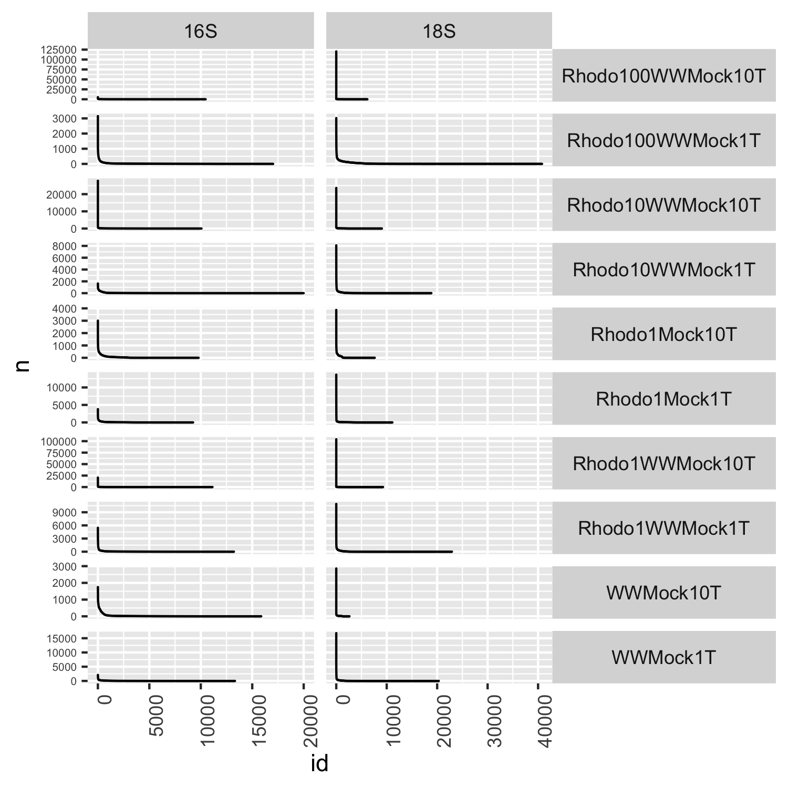
</td>
<td valign="top">
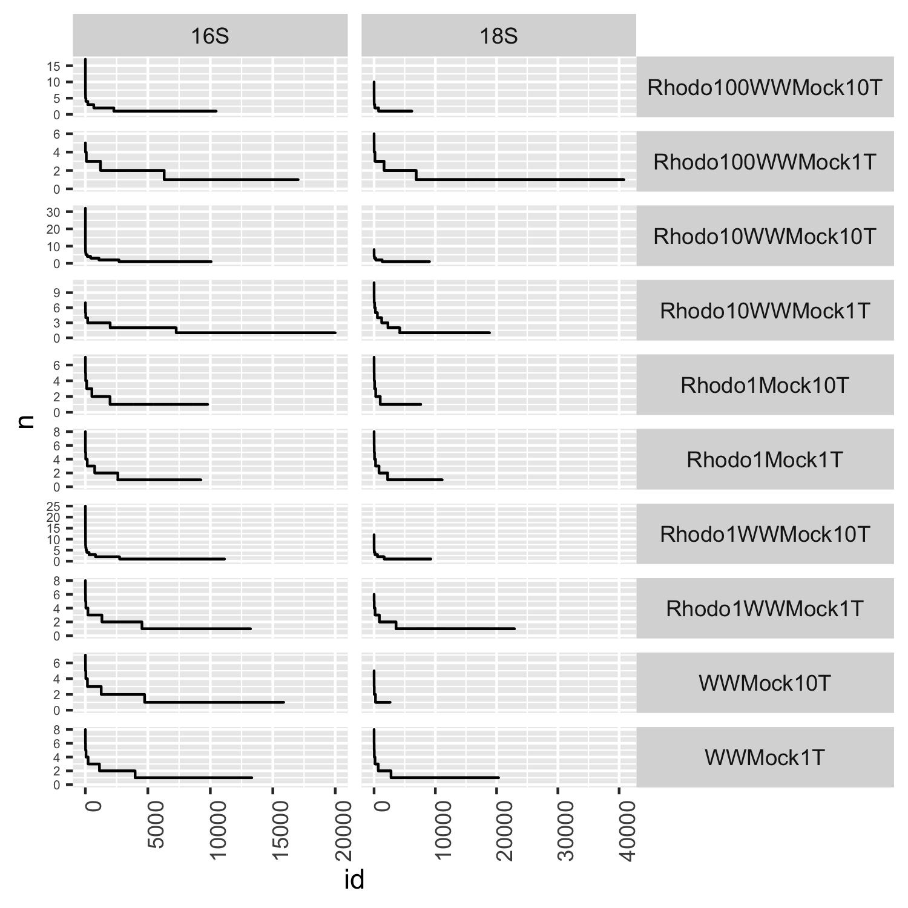
</td>
</tr>
</table>

## Distribution of connections

<td valign="top">
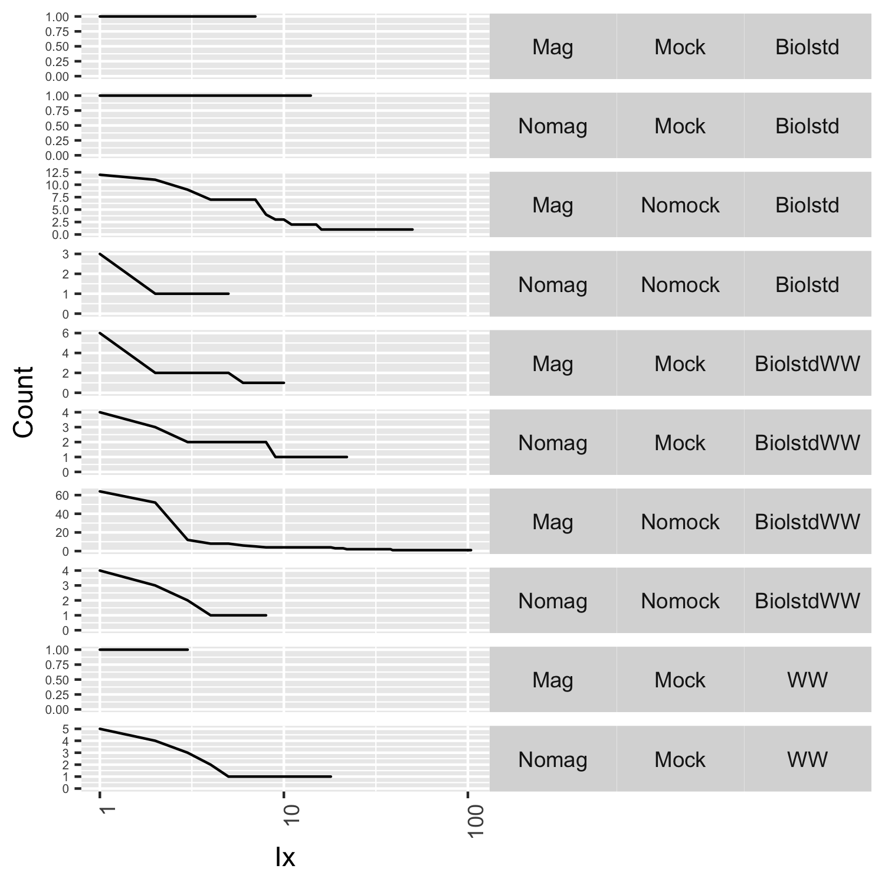
</td>

## Abundance profiles

The abundance columns are:

-   Rhodo1Mock10T
-   Rhodo1WWMock10T
-   Rhodo10WWMock10T
-   Rhodo100WWMock10T
-   WWMock10T
-   Rhodo1Mock1T
-   Rhodo1WWMock1T
-   Rhodo10WWMock1T
-   Rhodo100WWMock1T
-   WWMock1T

<td valign="top">
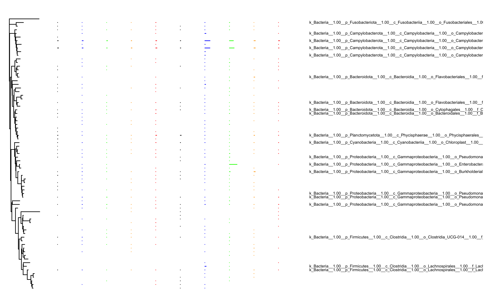
</td>
<td valign="top">
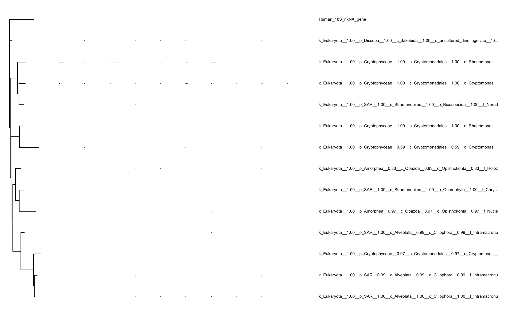
</td>

## Tanglegram of mockmag

The abundance columns are:

-   Rhodo1Mock1T
-   Rhodo1WWMock1T
-   Rhodo10WWMock1T
-   Rhodo100WWMock1T
-   WWMock1T

Non-normalised connections
<td valign="top">
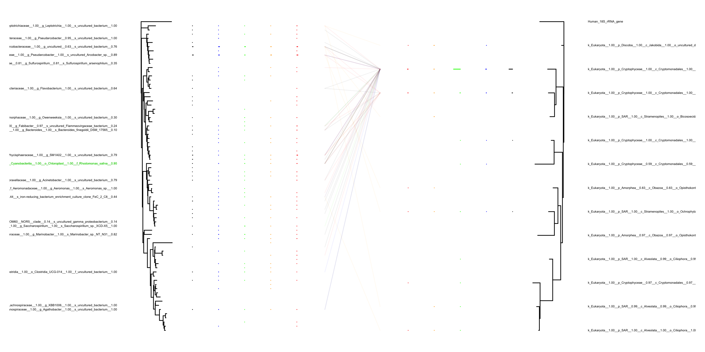
</td>
Normalised connections
<td valign="top">
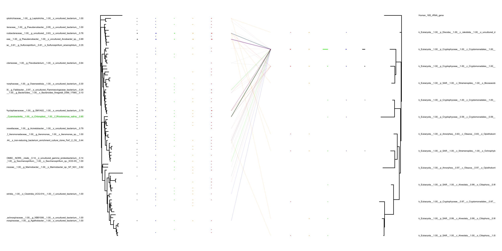
</td>

## Tanglegram of mocknomag

The abundance columns are:

-   Rhodo1Mock10T
-   Rhodo1WWMock10T
-   Rhodo10WWMock10T
-   Rhodo100WWMock10T
-   WWMock10T

Non-normalised connections
<td valign="top">
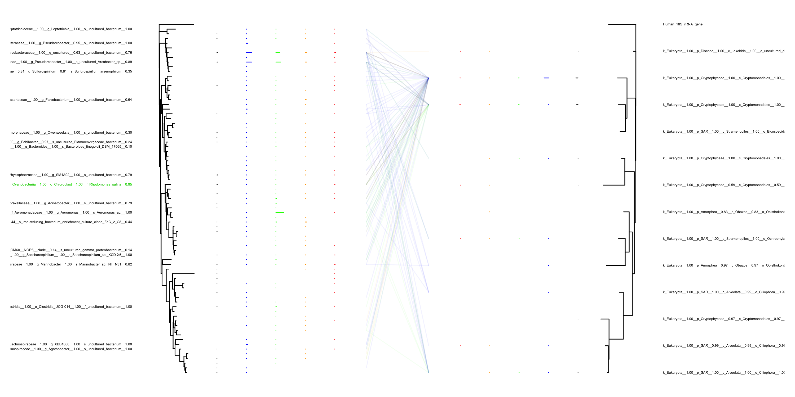
</td>
Normalised connections
<td valign="top">
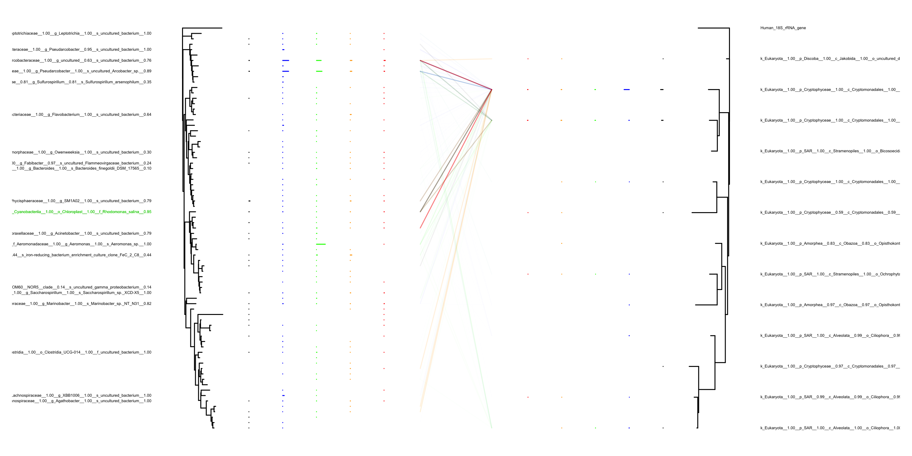
</td>

## Standard abundances

<table>
<tr>
<td>
Absolute mock abundances
</td>
<td>
Proportional mock abundances
</td>
</tr>
<tr>
<td valign="top">
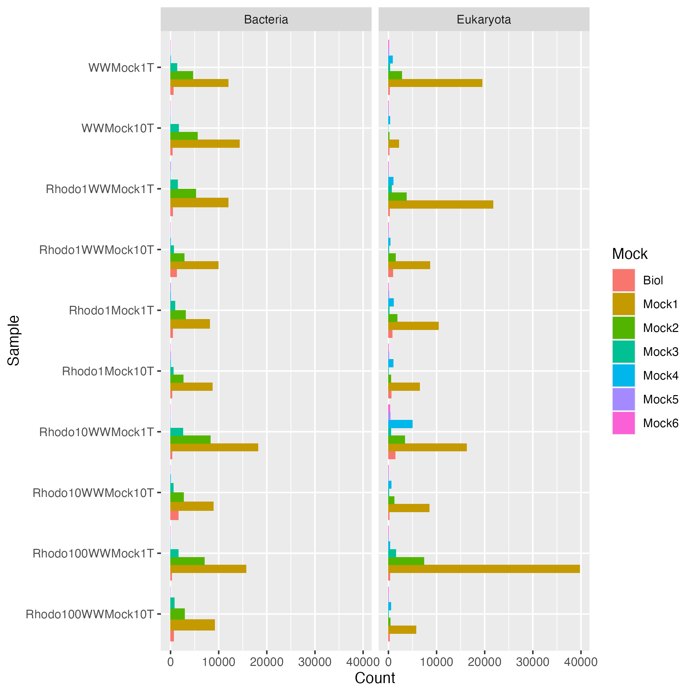
</td>
<td valign="top">
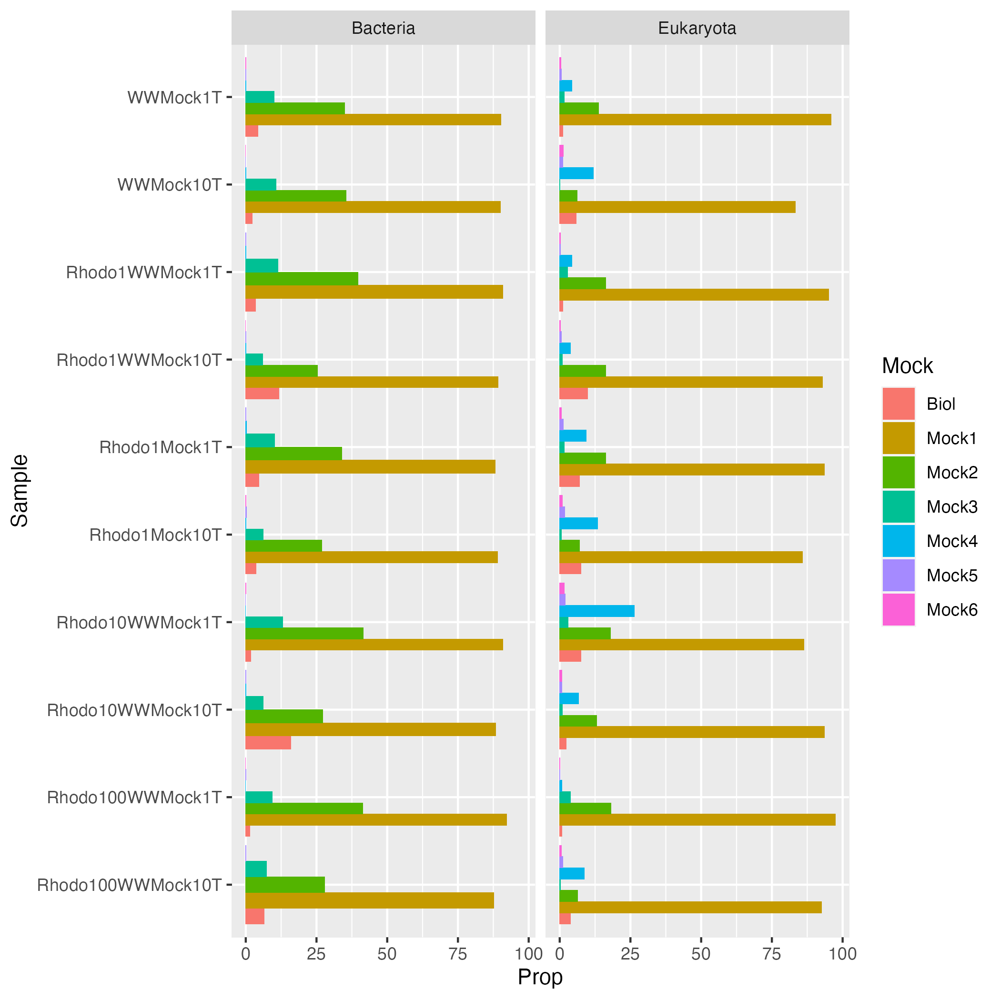
</td>
</tr>
</table>
Absolute biological standard abundances
<td valign="top">

</td>

## OTU sampling frequency

<td valign="top">
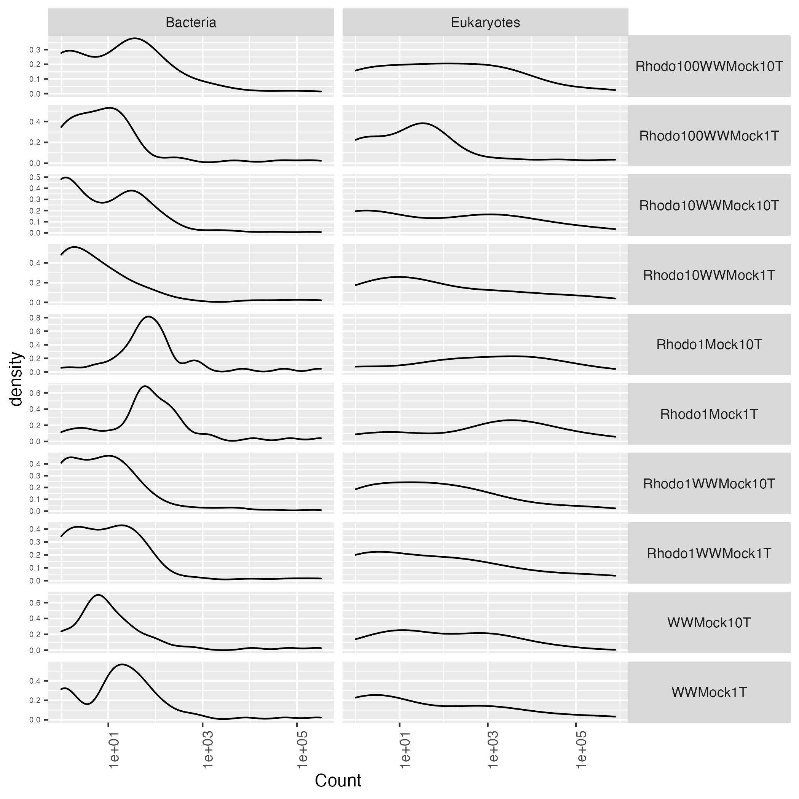
</td>
